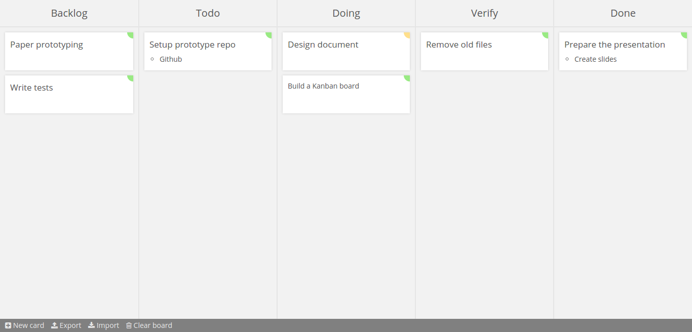

# Kanban board

## Features
- Set the priority of cards
- Set the status of a card
	- Backlog
	- Todo
	- Doing
	- Verify
	- Done
- Export and import to JSON for backups
- Write your cards in Markdown

## Installation:
- Download the repo
- Install with: `npm install`
- Start the app with `node app.js`
- Browse to `http://localhost:1337`